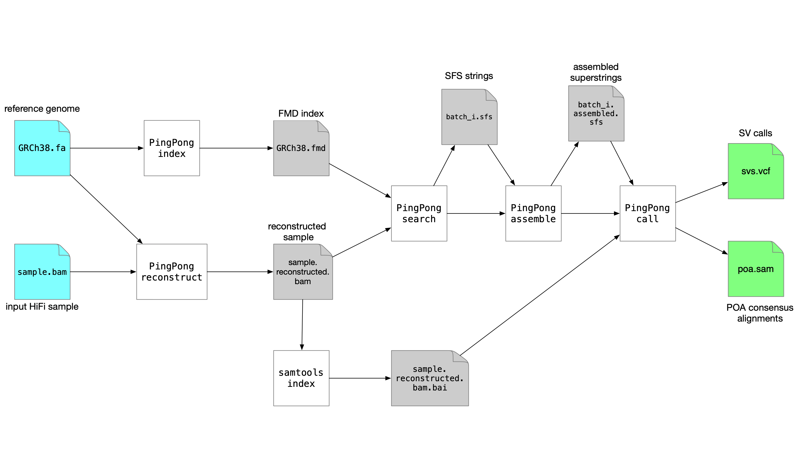

[](https://anaconda.org/bioconda/svdss)

# SVDSS: Structural Variant Discovery from Sample-specific Strings

SVDSS is a novel method for discovery of structural variants in accurate long reads (e.g PacBio HiFi) using sample-specific strings (SFS).

SFS are the shortest substrings that are unique to one genome, called target, w.r.t another genome, called reference. Here our method utilizes SFS for coarse-grained identification (anchoring) of potential SV sites and performs local partial-order-assembly (POA) of clusters of SFS from such sites to produce accurate SV predictions. We refer to [our manuscript on SFS](https://doi.org/10.1093/bioadv/vbab005) for more details regarding the concept of SFS.

## Download and Installation

You can "install" SVDSS in two different ways:
* [compiling it](#compilation-from-source) (**use this method if you want SVDSS to be fully optimized**)
* [downloading a static binary](#static-binary)
* [installing from conda](#install-from-conda)

#### Compilation from Source
To compile and use SVDSS, you need:
* a C++14-compliant compiler (GCC 8.2 or newer)
* make, automake, autoconf
* cmake (>=3.14)
* git
* some other development libraries: zlib, bz2, lzma
* samtools and bcftools (>=1.9)

To install these dependencies:
```bash
# On a deb-based system (tested on ubuntu 20.04 and debian 11):
sudo apt install build-essential autoconf cmake git zlib1g-dev libbz2-dev liblzma-dev samtools bcftools
# On a rpm-based system (tested on fedora 35):
sudo dnf install gcc gcc-c++ make automake autoconf cmake git libstdc++-static zlib-devel bzip2-devel xz-devel samtools bcftools
```

The following libraries are needed to build and run SVDSS but they are automatically downloaded and compiled while compiling SVDSS:
* [htslib](https://github.com/samtools/htslib) built with [libdeflate](https://github.com/ebiggers/libdeflate) for BAM processing.
* [ksw2](https://github.com/lh3/ksw2) for FASTA and FASTQ processing.
* [ropebwt2](https://github.com/lh3/ropebwt2) for FMD index creation and querying.
* [abPOA](https://github.com/yangao07/abPOA) for POA computation.
* [parasail](https://github.com/jeffdaily/parasail) for local alignment of POA consensus.
* [rapidfuzz](https://github.com/maxbachmann/rapidfuzz-cpp) for string similarity computation.
* [interval-tree](https://github.com/5cript/interval-tree) for variant overlap detection and clustering.

To download and install SVDSS (should take ~10 minutes):
```bash
git clone https://github.com/Parsoa/SVDSS.git
cd SVDSS 
mkdir build ; cd build
cmake -DCMAKE_BUILD_TYPE=Release ..
make
```
This will create the `SVDSS` binary in the root of the repo.

#### Static Binary
For user convenience, we also provide a static binary for x86_64 linux systems (see [Releases](https://github.com/Parsoa/SVDSS/releases/latest)) - use at your own risk. If it does not work, please let us know or build it yourself :)

#### Install from Conda
SVDSS is available on bioconda:
```bash
conda create -n svdss -c conda-forge -c bioconda svdss
```
This will create the environment `svdss` that includes `SVDSS` and its runtime dependencies (i.e., `samtools` and `bcftools`).

## Usage Guide for the Impatient
Please refer to or use [Snakefile](Snakefile)/[run-svdss.sh](tests/run-svdss.sh).

```
Index reference/sample:
    SVDSS index --fastq/--fasta /path/to/genome/file --index /path/to/output/index/file

    Optional arguments:
        -b, --binary                            output index in binary format. Allows for another index to be appended to this index later.
        -a, --append /path/to/binary/index      append to existing binary index.

Extract SFS from BAM/FASTQ/FASTA files:
    SVDSS search --index /path/to/index --fastq/--bam /path/to/input --workdir /output/directory

    Optional arguments:
            --assemble                          automatically runs SVDSS assemble on output

Assemble SFS into superstrings:
    SVDSS assemble --workdir /path/to/.sfs/files --batches /number/of/SFS/batches

Reconstruct sample:
    SVDSS smooth --workdir /output/file/direcotry --bam /path/to/input/bam/file --reference /path/to/reference/genome/fasta

Call SVs:
    SVDSS call --workdir /path/to/assembled/.sfs/files --bam /path/to/input/bam/file --reference /path/to/reference/genome/fasta

    Optional arguments:
        --clipped                               calls SVs from clipped SFS.
        --min-cluster-weight                    minimum number of supporting superstrings for a call to be reported.
        --min-sv-length                         minimum length of reported SVs. Default is 25. Values < 25 are ignored.

General options:
    --threads                                   sets number of threads, default 4.
```

## Detailed Usage Guide
SVDSS requires as input the BAM file of the sample to be genotyped, a reference genome in FASTA format. To genotype a sample we need to perform the following steps:

1. Build FMD index of reference genome (`SVDSS index`)
2. Smooth the input BAM file (`SVDSS smooth`)
3. Extract SFS from smoothed BAM file (`SVDSS search`)
4. Assemble SFS into superstrings (`SVDSS assemble`)
5. Genotype SVs from the assembled superstrings (`SVDSS call`)

In the guide below we assume we are using the reference genome file `GRCh38.fa` and the input BAM file `sample.bam`. We assume both files are present in the working directory. All of SVDSS steps must be run in the same directory so we always pass `--workdir $PWD` for every command.

Note that you can reuse the index from step 1 for any number of samples genotyped against the same reference genome.

Figure below shows the full pipeline of commands that needs to be run:



We will now explain each step in more detail:

### Index reference genome

The FMD index is the same as from PingPong:

```
SVDSS index --fastq GRCh38.fa --index GRCh38.bwt
```

The `--index` option specifies the output file name.

### Smoothing the target sample

Smoothing removes  nearly all SNPs, small indels and sequencing errors from reads. This results in smaller number of SFS being extracted and increases the relevance of extracted SFS to SV discovery significantly. To smooth the sample run: 

```
SVDSS smooth --bam sample.bam --workdir $PWD --reference GRCh38.fa --threads 16
```

This produces a file named `smoothed.selective.bam`. This file is sorted in the same order as the input file, however it needs to be indexed again with `samtools index`. The command also produces two files `smoothed_reads.txt` and `ignored_reads.txt` in `workdir` that contains the ids of reads that were smoothed and ids of reads that didn't have any large (> 20bp) indels in their alignemnts. This information is used by the next step.

### Extract SFS from target sample

To extract SFS run:

```
SVDSS search --index GRCh38.bwt --bam smoothed.selective.bam --workdir $PWD
```

This step produces a number of `solution_batch_<i>.sfs` files. These files include the coordinates of SFS relative to the reads they were extracted from.

### Assemble SFS into superstrings

To reduce redundancy, overlapping SFS on each reads are merged. Simply run:

```
SVDSS assemble --workdir $PWD --batches N
```

Here `N` is the number of files produces by the previous step. Each `.sfs` file will be processed independently and output as a `solution_batch_<i>.assembled.sfs` file.

You can combine SFS extraction and assembly by passing `--assemble` to `SVDSS search`. This will automatically run the assembler.

### Call SVs

We are now ready to call SVs. Run (note that the input `.bam` must be indexed using `samtools index` before running this):

```
SVDSS call --reference GRCh38.fasta --bam smoothed.selective.bam --workdir $PWD --batches N
```

You can filter the reported SVs by passing the `--min-sv-length` and `--min-cluster-weight` options. These options control the minimum length and minimum number of supporting superstrings for the reported SVs. Higher values for `--min-cluster-weight` will increase precision at the cost of reducing recall. For a 30x coverage sample, `--min-cluster-weight 4` produced the best results in our experiments.

This commands output two files: `svs_poa.vcf` that includes the SV calls and `poa.sam` which includes alignments of POA contigs to the reference genome.

### Snakemake workflow

For user convenience, we distribute a Snakefile to run the entire pipeline, from reference + aligned reads to SVs:
```
# update config.yaml to suit your needs
# run:
snakemake [-n] -j 4
```

##### Example

**Note:** to run this example, `samtools` and `bcftools` **must be in your path**. Running `SVDSS` on the example data, once downloaded, should take less than 5 minutes.

```bash
# Download example data from zenodo
wget https://zenodo.org/record/6563662/files/svdss-data.tar.gz
mkdir -p input
tar xvfz svdss-data.tar.gz -C input
# Download SVDSS binary
wget https://github.com/Parsoa/SVDSS/releases/download/v1.0.3/SVDSS_linux_x86-64
chmod +x SVDSS_linux_x86-64

# Download snakemake workflow and run it
wget https://raw.githubusercontent.com/Parsoa/SVDSS/master/config.yaml
wget https://raw.githubusercontent.com/Parsoa/SVDSS/master/Snakefile
snakemake -p -j 2

# Alternatively, you can use the bash helper script
wget https://raw.githubusercontent.com/Parsoa/SVDSS/master/tests/run-svdss.sh
bash run-svdss.sh ./SVDSS_linux_x86-64 input/22.fa input/22.bam svdss-output
```

### Authors

SVDSS was developed by Luca Denti and Parsoa Khorsand.

For inquiries on this software please open an [issue](https://github.com/Parsoa/SVDSS/issues) or contact either [Parsoa Khorsand](https://github.com/parsoa) or [Luca Denti](https://github.com/ldenti/).

### Citation

SVDSS is currently pending peer review. A pre-print is available on [BioRxiv](https://www.biorxiv.org/content/10.1101/2022.02.12.480198v1).

##### Experiments
Instructions on how to reproduce the experiments described in the manuscript can be found [here](https://github.com/ldenti/SVDSS-experiments) (also provided as submodule of this repository).
